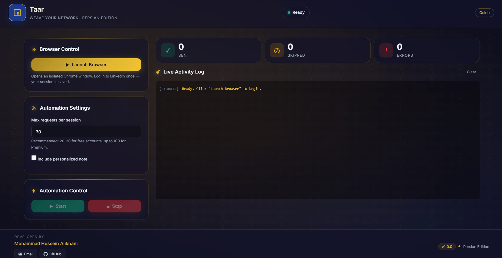

<div align="center">

# Taar · تار
**Weave your network.** Smart, human-like LinkedIn networking automation — built on Bun & Electrobun.


[Features](#-features) · [Quick Start](#-quick-start) · [How It Works](#-how-it-works) · [FAQ](#-faq) · [Contributing](#-contributing)


</div>

---


**Taar** (Persian: *the warp threads of a carpet*) is a lightweight desktop app that opens an isolated browser, sends connection requests to people-search results on your behalf, and behaves like a careful human while doing it — randomized delays, per-session behavior personas, exponential cooldown when something goes wrong, and a selector engine that learns what works on LinkedIn's changing DOM.

Built on **Bun** and **[Electrobun](https://electrobun.dev)** instead of Electron: smaller footprint, faster startup, one runtime end to end.

## ✨ Features

| | |
|---|---|
| 🖥 **Tiny desktop shell** | Electrobun 2.0 + Bun — no Electron, no bundled Chromium; uses your installed Chrome/Edge |
| 🧠 **Adaptive pacing** | Exponential cooldown after consecutive errors; successes reset it. Protects your account |
| 🎭 **Behavior personas** | Every session picks a rhythm at random (steady / brisk / careful) — no two runs look alike |
| 🔍 **Self-learning selectors** | Ranks and remembers which DOM strategies find Connect buttons; survives LinkedIn redesigns |
| ⏭ **Pending-aware** | Detects and skips "Pending" (withdraw) invitations instead of timing out on them |
| 🛡 **Limit detection** | Stops automatically on weekly-limit or restriction screens (English + Persian) |
| 💾 **Persistent sessions** | Log in once — cookies and storage are saved and reused |
| 🔄 **Crash-proof relaunch** | Browser liveness watchdog + force-restart + self-healing UI: closing the browser never dead-ends the app |
| 📝 **Personalized notes** | Optional note per invitation with quota tracking and smart truncation |
| 🪞 **Persian-inspired UI** | Boteh-jeghe patterns, gold tashir accents, carpet-border cards — with an in-app guide |

## 🚀 Quick Start

### Prerequisites

- **[Bun](https://bun.sh) 1.1+**
- **Google Chrome** (or Edge) installed on the system
- A LinkedIn account

### Install & Run

```bash
git clone https://github.com/MHAlikhani/LinkedIn-Assistant.git
cd LinkedIn-Assistant
bun install
bun start
```

The first run downloads the Electrobun runtime once. Then:

1. Click **Launch Browser** and log in to LinkedIn in the window that opens.
2. Navigate to **linkedin.com/search/results/people**.
3. Set the number of requests (20–30 is a safe daily range for free accounts).
4. Click **Start**.

### Build for distribution

```bash
bun run build
```

## 📦 How It Works

```text
┌─────────────────────────────────────────────┐
│  Electrobun main process (Bun runtime)      │
│  ├── typed RPC ⇄ webview UI                 │
│  └── spawns ──► Bot child process (Bun)     │
│                  ├── DecisionEngine         │
│                  ├── HumanSimulator         │
│                  ├── SmartElementFinder     │
│                  ├── ModalStateMachine      │
│                  ├── NavigationGuard        │
│                  └── Playwright (Chrome)    │
└─────────────────────────────────────────────┘
```

The bot runs in an isolated child process and talks to the UI over a typed RPC bridge. When you close the browser, the watchdog notices within seconds, the process exits cleanly, and the Launch button comes back — no app restart needed.

## ⚙️ Configuration

Environment variables:

| Variable | Default | Description |
|---|---|---|
| `BOT_RUNTIME` | `bun` | Set to `node` to run the bot child process on Node.js ≥ 20 |
| `LOG_LEVEL` | `info` | `debug` · `info` · `warn` · `error` |

Data files (created on demand in the project folder):

| File | Purpose |
|---|---|
| `data/session.json` | Saved LinkedIn login session |
| `data/selector-memory.json` | Learned selector rankings |

## 🧪 Development

```bash
bun test            # 81 tests across 9 suites
bun run lint        # ESLint
bun start           # dev launch (hot rebuild)
bun run clean       # remove reports + learned data
```

Project layout:

```text
src/
├── bun/          Electrobun main process (window, RPC handlers)
├── runtime/      Bot process manager + runtime resolver
├── schemas/      Shared RPC schema
├── mainview/     Webview UI (HTML/CSS/JS, Electrobun RPC client)
└── bot/          The automation brain
    ├── core/     LinkedInBot, DecisionEngine, HumanSimulator,
    │             ModalStateMachine, NavigationGuard, SessionManager
    ├── selectors/  Adaptive selector engine + learned memory
    └── utils/    IPC logger, sleep helpers
docs/             Architecture notes and ADRs
tests/            Unit + integration tests (bun test)
```

## ❓ FAQ

**Is this against LinkedIn's rules?**
Automated connection requests violate LinkedIn's User Agreement. Use it responsibly on your own account, keep volumes low, and understand the risk of account restriction. This software is provided for educational purposes.

**Why does it move the mouse and pause randomly?**
Delays are Gaussian-distributed, mouse paths follow eased curves, and each session adopts a different pacing persona — the goal is to behave like a tired human, not a `for` loop.

**The bot stopped after a few invitations.**
Check the log: a weekly-limit or restriction screen was detected and the bot stopped to protect your account.

**I closed the browser window.**
Just click **Launch Browser** again — recovery is automatic.

**Does it work on macOS/Linux?**
The stack is cross-platform (Electrobun supports all three). The bot resolves Chrome/Edge the same way; please report issues you hit on your OS.

## 📚 Documentation

- [Architecture](docs/ARCHITECTURE.md)
- [ADRs](docs/ard/) — decision records, including the [Electrobun migration](docs/ard/0008-electrobun-migration.md)
- [Changelog](CHANGELOG.md)

## 🤝 Contributing

Issues and PRs are welcome. Keep PRs focused; run `bun test` and `bun run lint` before submitting.

## 📄 License

[MIT](LICENSE) — © Mohammad Hossein Alikhani

---

<div align="center">

<sub>LinkedIn automation · LinkedIn bot · connection requests · networking automation · Playwright · Bun · Electrobun · desktop app · human-like automation · adaptive selectors</sub>

</div>
